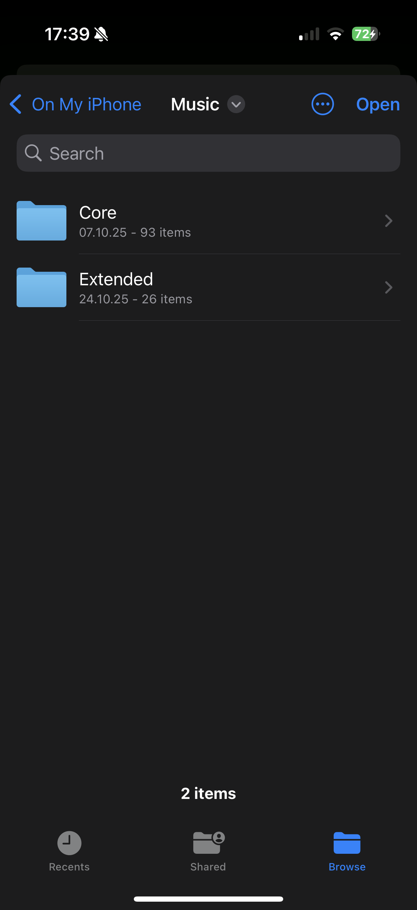
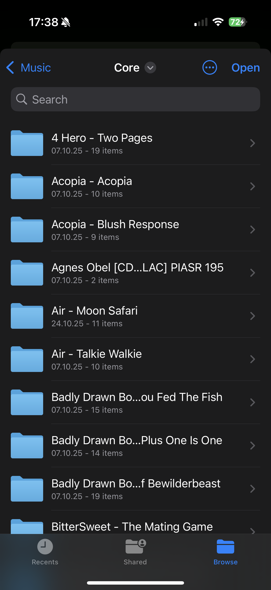
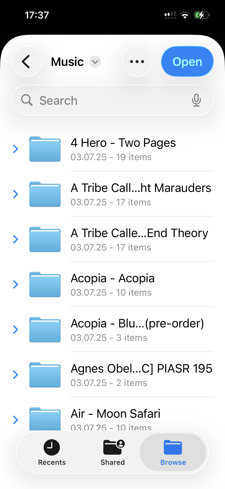
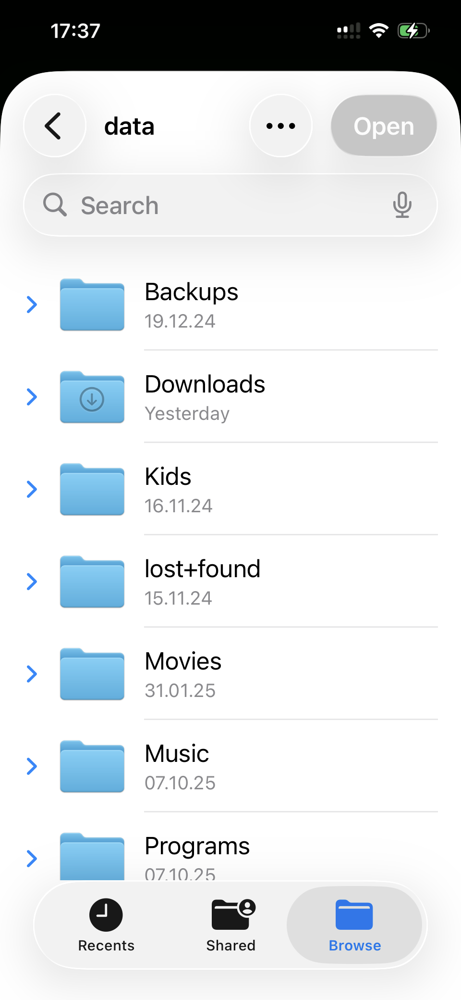

# UIDocumentPickerViewController does not allow picking folders on connected servers on iOS26

Up until iOS18 users were able to pick folders from connected servers (servers connected in the Files app) as well.

On iOS26, the picker allows for browsing into the connected servers, but the Select button is greyed out and does nothing when tapped.

## Local & SMB folders on iOS 18.7

## Local & SMB folders on iOS 26.1

Note that the Open button is disabled when trying to pick a folder on an SMB share on iOS 26.1, versus it being enabled under 18.7.
